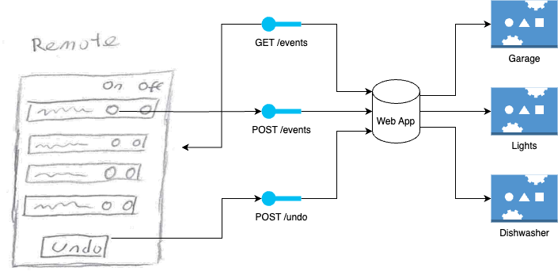

# Home automation system

## Requirements

- Some kind of deployable webapi to act as a central controller
- a generic endpoint to handle 

## Design

The webapp is to be developed in Typescript, running an Expressjs webserver. Tests will be handled by Jest.

The webapp will have three endpoints as described below handling the forwarding of requests to the proper components. a stub will be used to define the downstream communication which will just log the action. Depending on how the Remote is setup there may need to be more development (IE this is a hardware controller and its unchanging) to interface with the remote easier.

### Endpoints
GET /event - Get the currently connected devices
- Response message: `
{ 
    "Resources": [
        {"Name": "Garage", "SupportedEvents":["Open","Close"]},
        {"Name": "Dishwaster", "SupportedEvents":["On","Off"]},
        {"Name": "Living Room Light", "SupportedEvents":["On","Off"]}
    ]
}
`

POST /event - Raise an event
- Request Body: `
{
    "Name": "Living Room Light",
    "TargetState": "On" 
}
`

POST /undo - Undo the last event

# Design Descisions

## Supported Events

I think as "On" and "Off" may not apply to some devices it might be best to provide the device with a unique named boolean value instead of passing True or False back and forth causing some confusion. The translation should be handled in the webapp for maximum flexibility.

## Undo functionality

To implement the undo functionality there is a problem. If a device is "on" and the "on" button is pressed followed by the "undo" button what should happen. 

#1 - If the state change is stored it would understand that the state hasnt changed and to do nothing. This would most closely match what the user expects however it would require additional complexity.

#2 - The simple approach is to simply store the last event raised and when the undo button is pressed, raise the last event with a toggled state.

Due to the assumptions page I will design with #2 in mind, but for productionizing down the line it could be replaced with #1

## Resources

As the collection and storage are out of scope for this example they will all be hardcoded. Before productionization I would reccomend replacing this with some dynamic resource collector.

## Running the project

Firstly install the packages with `npm install` and then the project should be ready to go.
run the command `npm run start` and it will lanch a webserver.
If you dont have any other dev tools your browser should resolve `http://localhost:3001/event` with the configuration items.